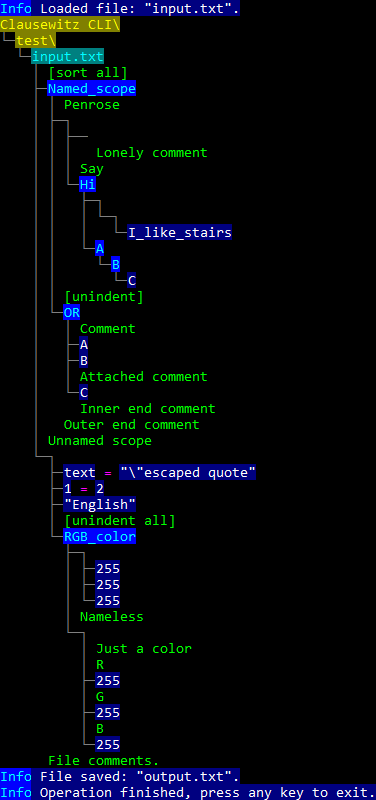

# Clausewitz.NET
## Introduction
This .NET Core interpreter for Clausewitz's scripting language helps with reading, writing, editing and querying the contents of standard Clausewitz files made by Paradox Interactive for their various soft-coded games. 

This interpreter uses an abstract data tree structure when tokenizing the Clausewitz files, and offers pragma commands as sorting and indenting and enforces comment association to prevent their lose, therefore it could be used as a cleanup tool for messy projects that were already made around Clausewitz files.

## Dependencies
1. The interpreter without the CLI requires **.NET Core 2.0**.
2. The CLI requires my **[ANSITerm](https://github.com/david-tamar/ansi-term)**  library[1](#WhyANSITerm). If your IDE does not resolve this dependency from Nuget, then you may either git clone that library and attach it to this solution, or you may download the package `Tamar.ANSITerm` itself from Nuget's website.

## I/O results

**A prettyprint of an interpreted clausewitz file:**

Input: **[input.txt](Clausewitz.CLI%2FTest%2Finput.txt)**

Output: **[output.txt](Clausewitz.CLI%2FTest%2Foutput.txt)**

## Notes:
<a name="WhyANSITerm">1</a>: I created my own ANSI-Compliant System.Console implementation because .NET's default System.Console could not display 24-bit colors properly on Linux terminals which support ANSI escape codes.
